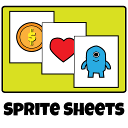
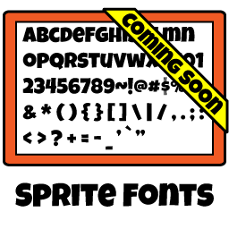
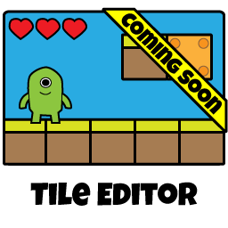



## What is Fanny Pack?

Fanny Pack is a suite of tools that I developed for my game programming students. There are certainly 
better products out there, but I wanted my students to have access to free tools and, more importantly, 
access to the source code for those tools. I also didn't want the tools to look like poop that was 
designed in the 80's.

<table border="0" cellpadding="0" cellspacing="0" style="width:600px; margin-left:30px;">
	<tr>
		<td style="width:300px;">
			
		</td>
		<td style="text-align:center; white-space:nowrap;">
			
A tool to merge several art assets (objects  
			   within the game) into a single image, saving  
			   memory and reducing CPU-to-GPU chatter.
			

			
<a id="cmdShowFeaturesSheets" href="#null" class="btn btn-primary">Show Features</a>

		</td>
	</tr><tr>
		<td style="width:300px;">
			
		</td>
		<td style="text-align:center; white-space:nowrap;">
			
A tool to convert public domain TTF fonts  
			   into bitmap fonts - a format that is more  
			   easily consumed by game engines.
			

			
<a id="cmdShowFeaturesFonts" href="#null" class="btn btn-default disabled">Show Features</a>

		</td>
	</tr><tr>
		<td style="width:300px;">
			
		</td>
		<td style="text-align:center; white-space:nowrap;">
			
A tool that manages the placement of a fixed  
			   set of tiled images. By painting these tiles  
			   into place, entire game worlds can be made.
			

			
<a id="cmdShowFeaturesTileEditor" href="#null" class="btn btn-default disabled">Show Features</a>

		</td>
	</tr>
</table>

## What Makes Fanny Pack So Special?

It's certainly not its features. The commercial offerings provide options and functionality that 
aren't (yet) supported in this suite of tools. The biggest benefits of Fanny Pack are that it's 
open source, and that it doesn't require you to install anything. Everything runs in your browser.

<h3>Everything Runs in Your Browser</h3>

You read that right. Everything runs in your browser. The technology that drives Fanny Pack is 
vanilla HTML5 and JavaScript. That means that you can use the app from any operating system, 
using any modern web browser.

You don't have to be an administrator on your computer. You don't have to worry about updates.

At least, that's the idea. I've been developing on my MacBook Pro, using Google's Chrome web 
browser. I'll be doing more extensive testing in the near future.

<h3>Your Assets, on Your Computer</h3>

There is no server component to FannyPack. Assets are loaded into your browser from your local
file system. Project files are loaded from and saved to your computer. Published resources are
generated on and saved to your computer.

Your data is never transmitted to the server. I don't need to see it, and I don't need to pay
for dedicated servers that churn through data or bandwidth for that data to travel to and from 
those servers.

In fact, if you really want to be cautious (*cough* *cough* tinfoil hat *cough*), you
can download the static HTML and Javascript and run them on your computer - even without an
internet connection.

<h3>Stop, Collaborate, and Listen! (Share Your Work)</h3>

Project files and published resources are generated as self-contained plaintext or compressed 
(ZIP DEFLATE) files. Just share the file via email, DropBox, or however your normally 
share files with teammates.

Resources are embedded in the project file, not linked. FannyPack embeds the source image 
data and configured options. Once assets have been added to the project, they're never 
referenced from your filesystem again. Share away.

## What's Up with the Name?

Fanny Pack was initially intended to simply be a sprite sheet packer. Texture Packer (by @CodeAndWeb) 
was the inspiration, so I chose a name that included "pack", but was less likely to get me sued. 

Since its inception, though, the project has grown to become a suite of tools. I decided to keep the 
name. It's a geeky representation of a utility belt. (Think Schneider or Batman.) Besides, I like it.

